## 🌐 Live Demo

- **URL**: [shop_cart_tvt.vn](https://vanthang.site/) |Hoặc| [vanthang.io.vn](https://vanthang.io.vn/)
- **Tài khoản dùng thử (User)**:
  - **Email**: `user1@gmail.com`
  - **Mật khẩu**: `123123`
- **Tài khoản Quản trị (Admin)**:  
  Vì lý do bảo mật, tài khoản Admin không được cung cấp công khai.  
  Vui lòng liên hệ **Quản trị viên** để được cấp quyền test các tính năng nâng cao.
- **Hỗ trợ kỹ thuật**:
  - 📧 Email: [thangtrandz04@gmail.com](mailto:thangtrandz04@gmail.com)
  - 📞 Hotline: **0389 215 396**
  - 💬 Fanpage: [vanthang.io.vn](https://vanthang.io.vn)

---

## 📸 Giao diện dự án (Screenshots)

### 👤 User Interface

| | |
|:---:|:---:|
| **🌙 Trang chủ (Dark)** | **☀️ Trang chủ (Light)** |
| 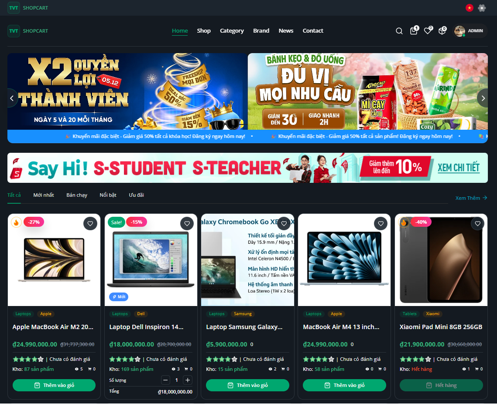 | 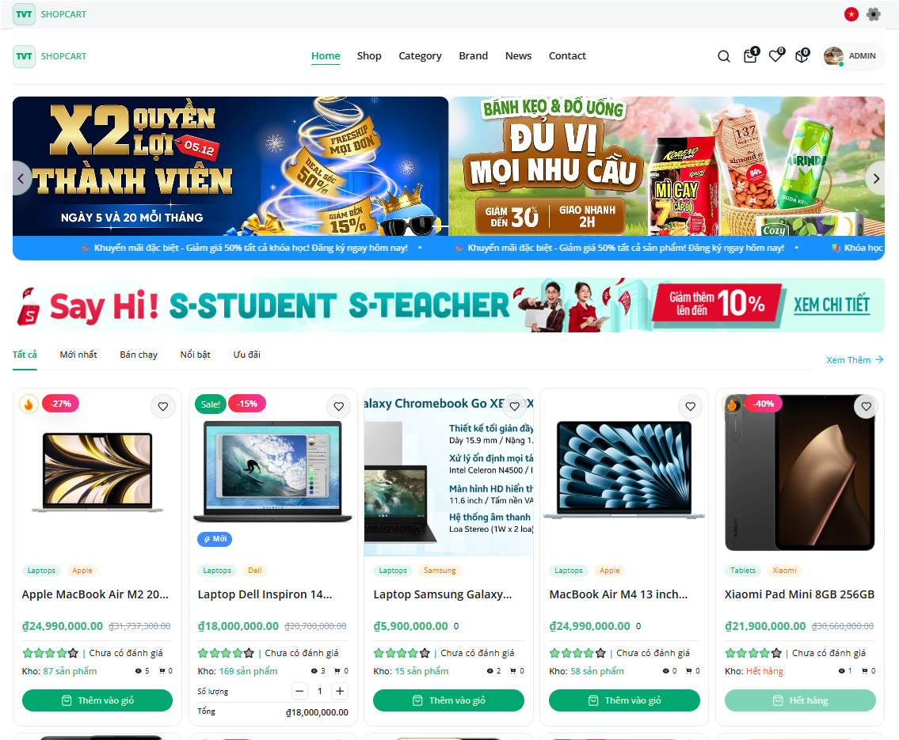 |
| **🛒 Cửa hàng** | **👤 Hồ sơ** |
| 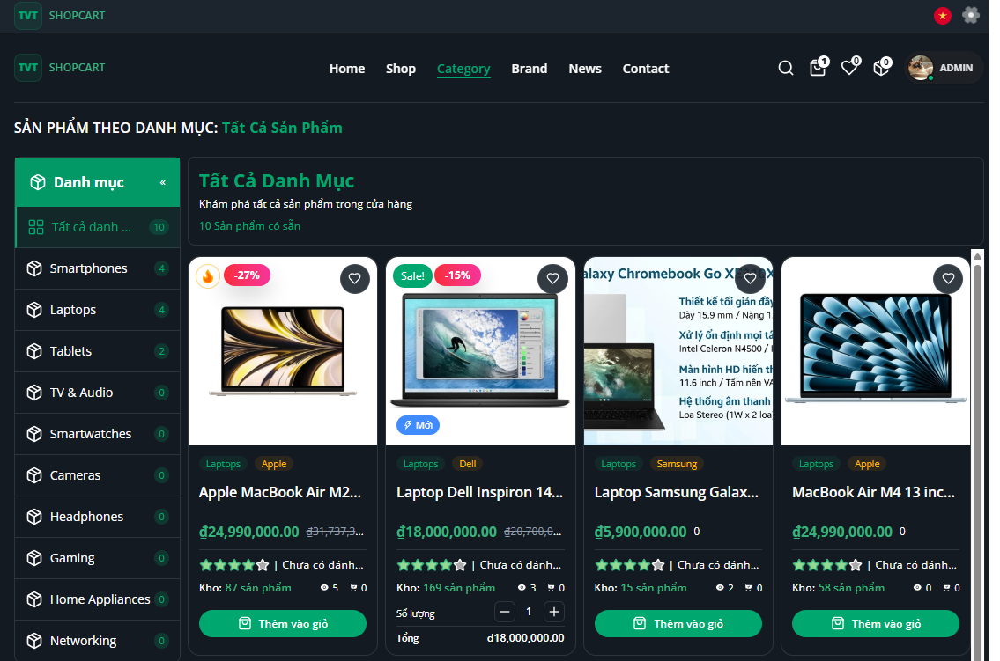 | 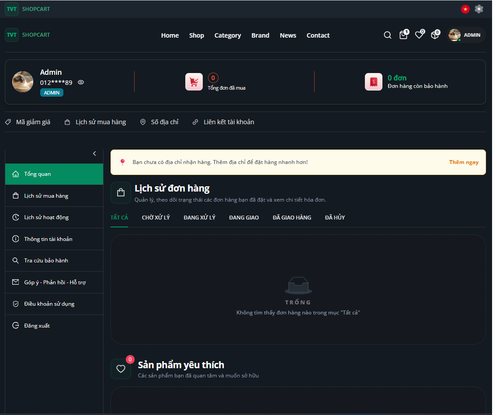 |

---

### 🛠️ Admin Dashboard

| | |
|:---:|:---:|
| **📊 Quản trị viên (Dark)** | **📈 Quản trị viên (Light)** |
| 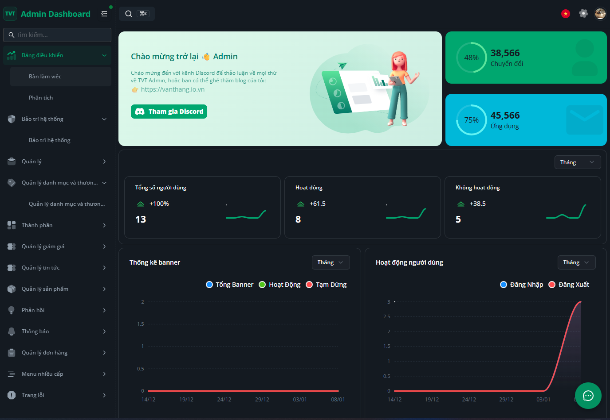 | 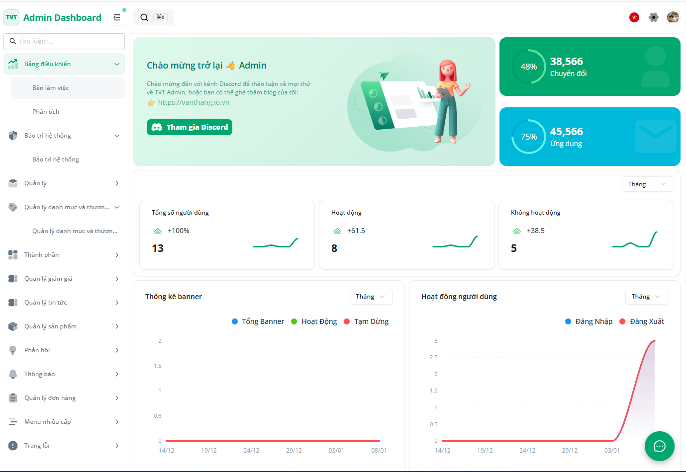 |
| **👨‍💼 Quản lý** | **⚙️ Hồ sơ Admin** |
| 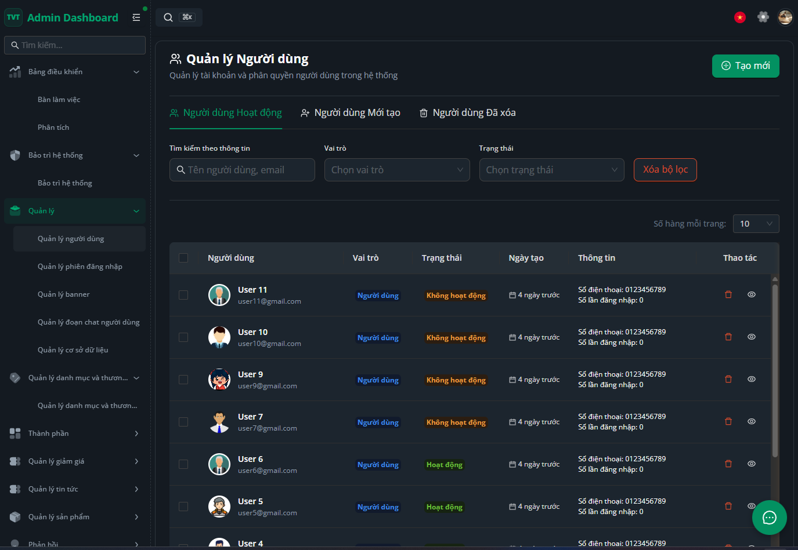 | 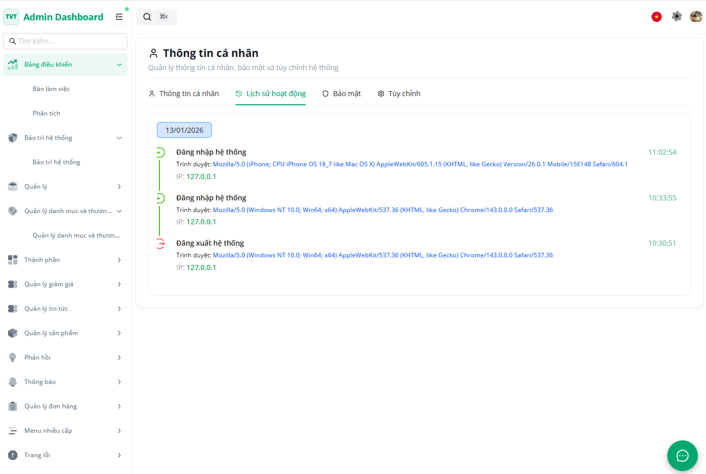 |

---

### 🔐 Xác thực & Dùng chung

| | |
|:---:|:---:|
| **🔑 Đăng nhập** | **📝 Đăng ký** |
| 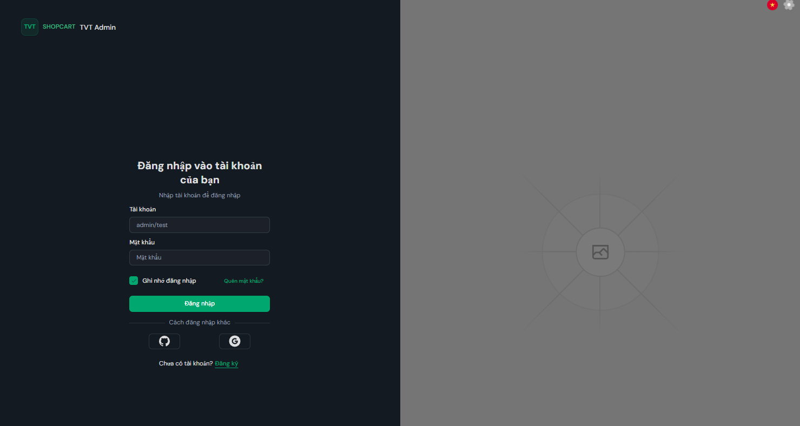 | 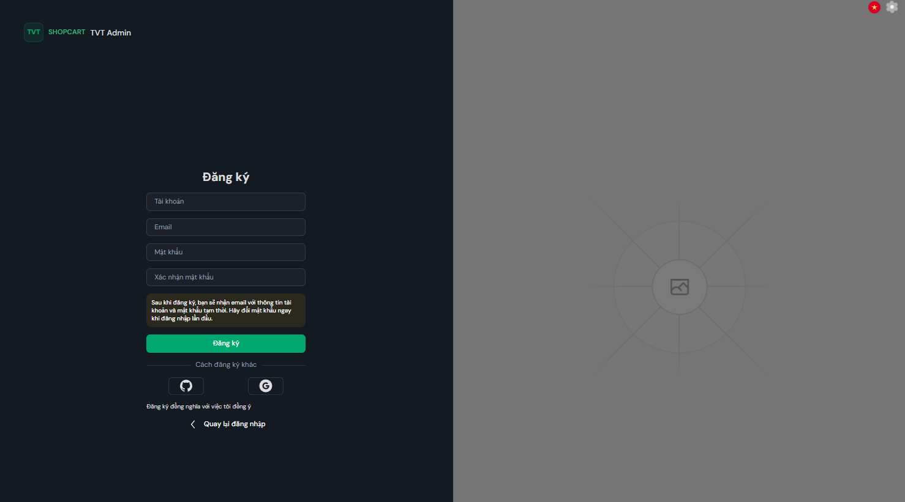 |
| **❓ Quên mật khẩu** | **📝 Login Auth Google && Github** |
| 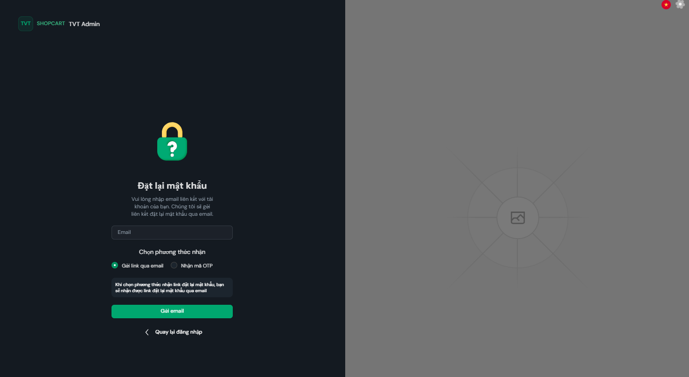 | 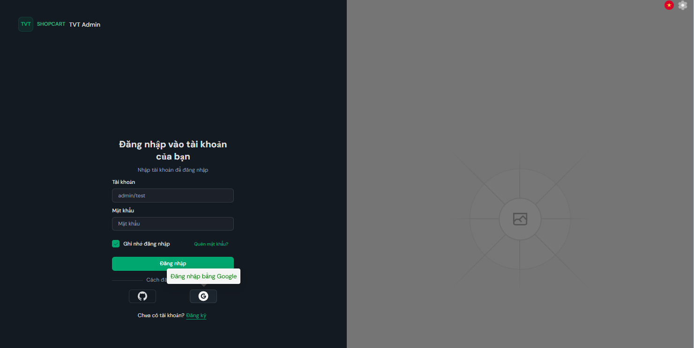 |

---

### 🚀 Real-time & System Core

| | |
|:---:|:---:|
| **Socket Client (User)** | **🛡️ Socket Monitor (Admin)** |
| 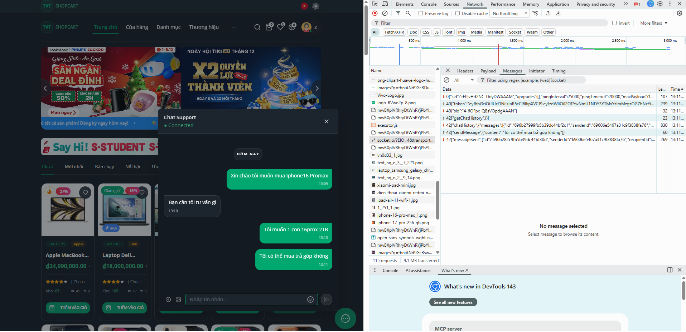 | 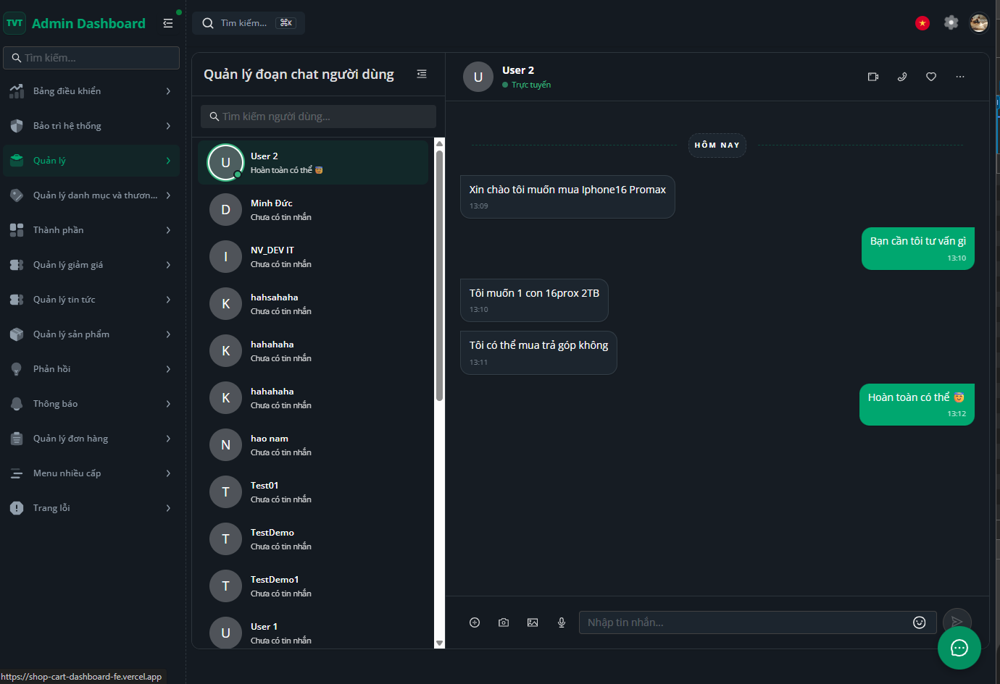 |
| **⚡ Full Stack Real-time** | **Custom Theme & Icons** |
| 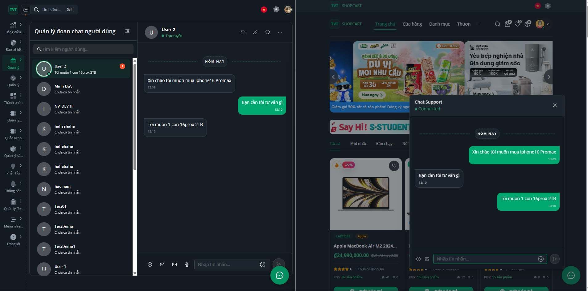 | 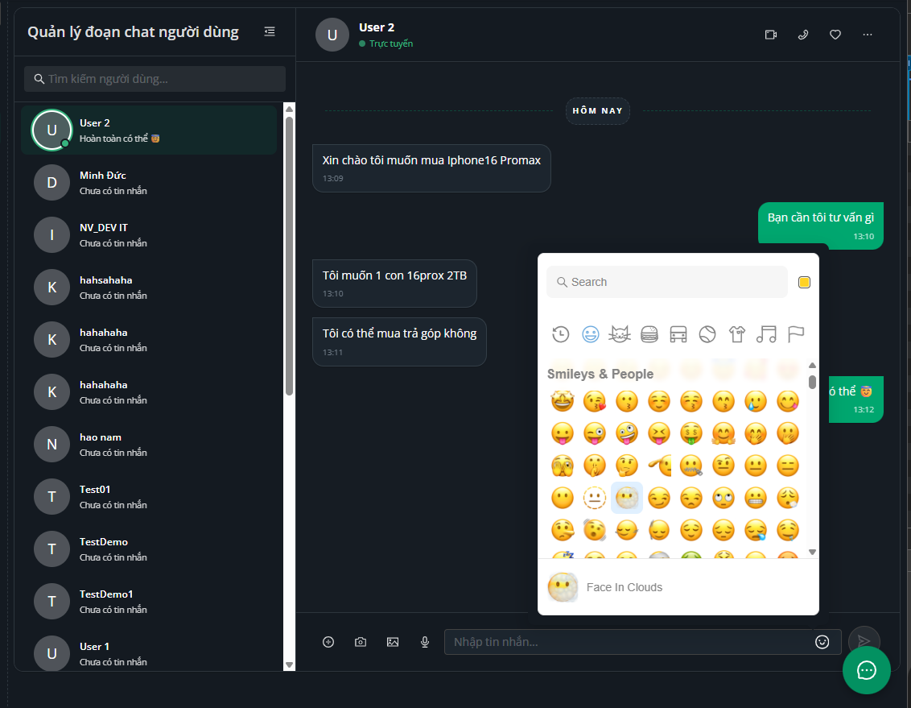 |

---

## 🏗️ Hệ sinh thái dự án (System Ecosystem)

Dự án không chỉ là một giao diện web mà là một hệ thống hoàn chỉnh gồm 3 thành phần cốt lõi hoạt động cùng nhau:

| Thành phần | Vai trò | Công nghệ chính | Repository |
|:--- |:--- |:--- |:--- |
| **🌐 Client Dashboard** | Giao diện người dùng (Shop) & Quản trị (Admin) | React 19, Vite, Antd | [Xem tại đây](https://github.com/thangtran1/ShopCart_Dashboard_FE) |
| **💻 Backend API** | Xử lý Logic, Bảo mật, DB & Quản lý đơn hàng | NesJs, Express, MongoDB | (Vui lòng liên hệ quản trị viên để biết thêm thông tin sourcode bạn nhé!!!) |
| **🛠️ Maintenance App** | Ứng dụng giám sát, bảo trì và kiểm tra hệ thống | React 19, Vite, Antd | [Xem tại đây](https://github.com/thangtran1/Maintenance-App) |


---

## Installation

```bash
# Clone the repository
git clone https://github.com/thangtran1/dashboard_admin_khoahocre_FE
cd dashboard_admin

# Install dependencies
pnpm install

# Setup env
pnpm setup-env

# Check connection with BE
pnpm check-backend
```

### Development

```bash
# Start all applications
pnpm dev

```

## 📁 Project Structure

```text
dashboard_admin/
├── src/
│   ├── api/          # Hàm gọi API, service backend
│   ├── assets/       # Hình ảnh, icon, font
│   ├── components/   # Component tái sử dụng
│   ├── contexts/     # React Contexts (Auth, Theme, ...)
│   ├── hooks/        # Custom hooks
│   ├── layouts/      # Layout tổng thể (Admin, Auth, ...)
│   ├── locales/      # Đa ngôn ngữ (i18n)
│   ├── pages/        # Các trang chính của ứng dụng
│   ├── router/       # Định nghĩa router, route config
│   ├── store/        # Global state (Redux, Zustand, ...)
│   ├── styles/       # CSS/Tailwind/SCSS toàn cục
│   ├── theme/        # Cấu hình màu sắc, typography
│   ├── types/        # Khai báo interface/type chung
│   ├── ui/           # Bộ UI cơ bản (Button, Input, Card, ...)
│   └── utils/        # Hàm tiện ích (formatDate, debounce, ...)
│
├── App.tsx           # Thành phần gốc của ứng dụng
├── main.tsx          # Điểm vào chính, khởi tạo React DOM
└── global.css        # CSS toàn cục áp dụng cho dự án

```

## 🛠️ Available Scripts

### Development Commands

```bash
pnpm dev              # Start all apps in development mode
```

## 🏗️ Technology Stack

### 1. Frontend (Current)
- **Core**: React.js 19, TypeScript, Vite 6
- **State**: Zustand, TanStack Query v5
- **UI**: Ant Design 5, Tailwind CSS 4, HeroUI
- **Animations**: Animations: Framer Motion 12, Motion

### 2. Backend Service
- **Core**: Nest.js 11, TypeScript
- **Database**: MongoDB (Mongoose ODM)
- **Auth & Security**: Passport.js (JWT & Google OAuth2), Bcryptjs (Mã hóa mật mã)
- **Real-time**: Socket.io (Websockets) với Admin UI tích hợp
- **Communications**: Nodemailer (Gửi email xác thực, thông báo)

### 3. Maintenance & DevOps
- **App**: Maintenance Dashboard (Theo dõi Health check hệ thống)
- **Tools**: pnpm, Scripts kiểm tra Backend tự động
- 
### Core Technologies

- **Framework**: React 18, Vite 6, TypeScript.
- **Language**: TypeScript
- **Package Manager**: pnpm
- **Styling**: Tailwind CSS, Antd

### UI & Components

- **UI Library**: Antd (React)
- **State Management**: Zustand, React Query (TanStack Query)
- **Form Handling**: React Hook Form
- **Data Tables**: Antd Table

## 🔧 Configuration

### Port Configuration

- **User Web**: <http://localhost:3000>
- **Admin Web**: <http://localhost:3000/dashboard/workbench>

### Code Style

- Follow the existing code style
- Use TypeScript for all new code

### Commit Convention

This project uses conventional commits:

```bash
feat: add new feature
fix: fix bug
docs: update documentation
style: format code
refactor: refactor code
test: add tests
chore: update build process
```

## Sự cố thường gặp – system-admin failed

Khi clone code mới về cập nhật env và kiểm tra kết nối với Backend

Cách xử lý nhanh (khuyến nghị):

Test connection trực tiếp terminal với lệnh:

```bash
pnpm check-backend
```

Mẹo: Hãy liên hệ qua email: thangtrandz04@gmail để biết thêm thông tin or liên hệ trực tiếp qua hotline: 0389215396 hoặc thông qua fanpage: vanthang.io.vn để được hỗ trợ

# 👨‍💻 We are 👨‍💻 The System Admins! 🖥️
